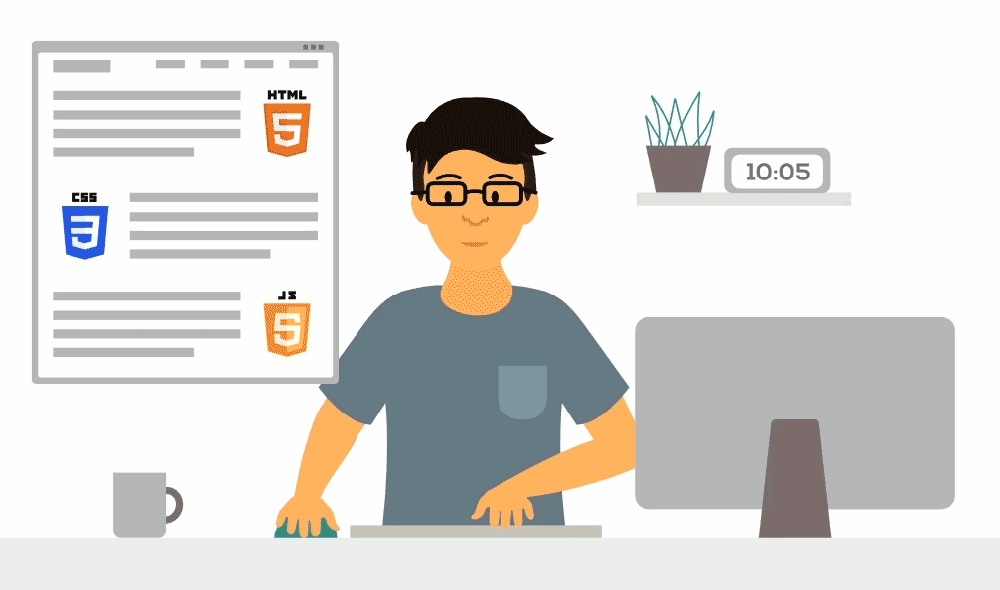

  <h1>
    <strong>Hey</strong>
     
    <strong>I'm Eslam Taha</strong>
  </h1>
  

    ⚛️ Frontend Web Developer | 🎨 UI/UX Designer | 🌍 Graphic Designer
  

  

     &nbsp;
    
  

  

  

  
<h2>
  💫 About Me
</h2>

- 🎓 **Computer Science & AI Student** at **Capital University (formerly Helwan University)**
- 🎨 **Front-End Developer | UI/UX & Graphic Designer**
- 🖌️ 2+ years of freelance experience in **branding, visual identity, and social media design**
- 💻 Skilled in **HTML, CSS, JavaScript, React, and Tailwind CSS**
- 🚀 Currently expanding into **back-end development & databases** to become a **Full-Stack (MERN) Developer**

## 🧠 Languages & Tools

  <!-- Programming Languages -->
  
  
  
  

  <!-- Front-End -->
  
  
  
  

  <!-- UI/UX & Graphic Design -->
  
  
  
  

  <!-- Tools -->
  
  
  
  
  
  
  

## 🛠️ Technologies and Tools I use

## 🎯 What I Do

- 🖥️ Build responsive, modern user interfaces with **HTML, CSS, JavaScript, React & Tailwind CSS**
- 🎨 Design brand identities, logos, and social media visuals for freelance clients
- 📚 Create educational materials and book covers/layouts for tutoring centers
- 🧩 Design full UI/UX experiences using **Adobe XD & Figma**

## 🏢 Experience

**Graphic Designer — Freelance, Cairo, Egypt (Remote)** · Present
- Designed visual identities, logos, and branding materials for 10+ clients across various industries
- Created educational materials and book covers/layouts for tutoring centers and organizations
- Built long-term relationships with repeat clients through consistent, high-quality work

## 🤝 Volunteering

**Graphic Designer — FOCS Academy, Cairo, Egypt**
Designed a complete visual identity for FOCS Academy, including the logo, brand assets, and visual identity guidelines. Case study and social media designs available on Behance.

## 📜 Certificates

- 🗄️ Database Fundamentals — Mahara-Tech (June 2026)
- 🐍 Python Programming Basics — Mahara-Tech (June 2026)
- 📜 JavaScript — Mahara-Tech (June 2026)

## 📊 GitHub Stats

  
  

<!-- 

  

 -->

 ## 🟡 Pacman Contribution Graph

  <picture>
    <source media="(prefers-color-scheme: dark)" srcset="https://raw.githubusercontent.com/Maher-Elmair/Maher-Elmair/output/pacman-contribution-graph-dark.svg" />
    <source media="(prefers-color-scheme: light)" srcset="https://raw.githubusercontent.com/Maher-Elmair/Maher-Elmair/output/pacman-contribution-graph.svg" />
    
  </picture>
   
  <i>Auto-generated every 12 hours via GitHub Actions.</i>

## 🐍 Contribution Snake

  

## 🔗 Let’s Connect 

  <table align="center">
    <tr>
      <td align="center" width="80">
        
      </td>
      <td align="center" width="80">
        
      </td>
      <td align="center" width="80">
        
      </td>
    </tr>
  </table>

